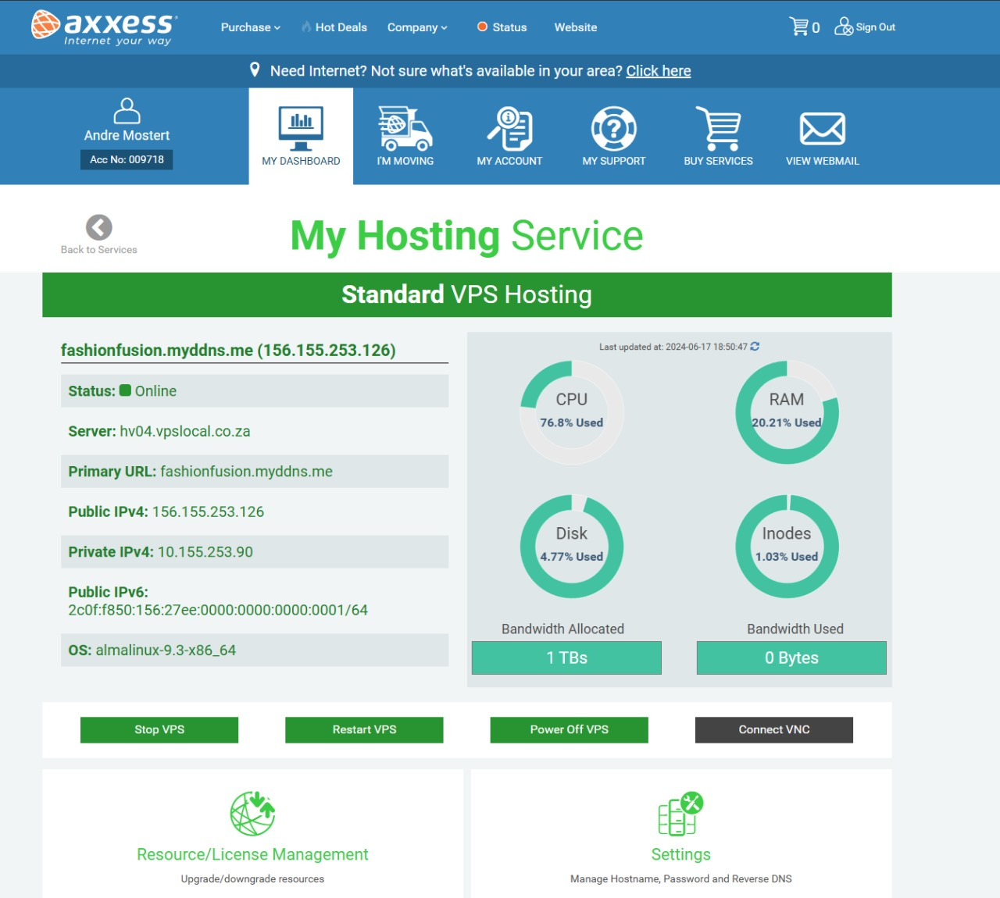

# Fashion Fusion User Manual

Welcome to Fashion Fusion! This user manual will guide you through accessing and using the Fashion Fusion web application.

## Table of Contents

1. [Introduction](#introduction)
2. [Accessing the Website](#accessing-the-website)
3. [Navigating the User Interface](#navigating-the-user-interface)
4. [Using the Contact Form](#using-the-contact-form)
5. [Registering an Account](#registering-an-account)
6. [Logging into Your Account](#logging-into-your-account)
7. [Adding Items to the Cart](#adding-items-to-the-cart)
8. [Using the Cart Page](#using-the-cart-page)
9. [Viewing Product Descriptions](#viewing-product-descriptions)
10. [Using the Search Function](#using-the-search-function)
11. [Troubleshooting](#troubleshooting)
12. [Support](#support)

## Introduction

Fashion Fusion is an online platform designed for fashion enthusiasts. Whether you're looking for the latest trends, fashion tips, or ways to get in touch with us, Fashion Fusion has you covered.

## Accessing the Website

To access the Fashion Fusion website, open your preferred web browser and enter the following URL:
- Desktop: [http://fashionfusion.myddns.me:3000/](http://fashionfusion.myddns.me:3000/)
- Mobile: [http://156.155.253.126:3000/](http://156.155.253.126:3000/)

**Note:** When using Chrome on a mobile device, the mobile link should be used since there is no SSL certificate.

This will take you to the homepage of Fashion Fusion.

## Navigating the User Interface

### Header

At the top of every page, you'll find the header which includes navigation buttons to different sections of the website:
- **Home:** Takes you to the homepage.
- **About:** Learn more about Fashion Fusion.
- **Contact:** Get in touch with us via the contact form.

### Home Page

The home page provides an overview of Fashion Fusion and highlights key features and content.

### About Page

The about page gives you more information about Fashion Fusion, including our mission and team.

### Contact Page

The contact page allows you to send us a message directly through the website.

## Using the Description

When viewing the shop, a clear description button can be noticed on each product. When the user clicks on the description button, a small pop-up will appear, providing the user with a small description of the item.

## Registering an Account

To register an account, follow these steps:

1. **Navigate to the Register Page:** Click on the "Register" button or navigate to the registration page.
2. **Fill Out the Registration Form:**
   - **Username:** Choose a unique username.
   - **Password:** Create a secure password.
   - **Confirm Password:** Re-enter your password to confirm.
   - **Email:** Enter a valid email address.
3. **Submit the Form:** Click the "Register" button to create your account. You will receive a confirmation message, and you will be redirected to the login page.

## Logging into Your Account

To log into your account, follow these steps:

1. **Navigate to the Login Page:** Click on the "Login" button or navigate to the login page.
2. **Fill Out the Login Form:**
   - **Username:** Enter your username.
   - **Password:** Enter your password.
3. **Submit the Form:** Click the "Login" button to access your account. Upon successful login, you will be redirected to your profile page.

## Using the Cart Page

After adding items to the cart, users can navigate to the Cart page to view and manage their selections. Please note that there is no actual payment system on this website as it is a dummy site.

1. **Navigate to the Login Page:** If not already logged in, users need to navigate to the Login page to access their cart.
2. **Register an Account (if needed):**
   - If the user does not have an account, they can register by filling out the prompts on the Register page. Remember your username and password for future logins.
3. **Add Products to the Cart:**
   - While browsing the shop, logged-in users can add products to the cart by clicking the "Add to Cart" button associated with each product.
4. **View Cart:**
   - Users can click on the Cart icon or navigate to the Cart page to view all items currently in their cart.
5. **Checkout (Clear Cart):**
   - To clear the cart, users can click on the "Checkout" button. This action will simulate clearing the cart, as there is no actual payment processing on this website.

## Using the Contact Form

The contact form is located on the Contact page. Here’s how to use it:

1. **Navigate to the Contact Page:** Click on the "Contact" button in the header.
2. **Fill Out the Form:**
   - **Name:** Enter your full name.
   - **Email:** Enter your email address.
   - **Message:** Type your message or inquiry.
3. **Submit the Form:** Click the "Submit" button. You will see a pop-up message saying "Email has been sent" once your message is successfully sent.

**Note:** The email service is currently non-functional. While you will receive a confirmation pop-up indicating that your message has been sent, please be aware that the email will not actually be delivered. We are working to resolve this issue.

## Viewing Product Descriptions

To view product descriptions:

1. **Browse the Shop:** Navigate through the shop to view various products.
2. **Click on the Description Button:** For each product, there is a description button. Click this button to view a pop-up with a brief description of the product.

## Using the Search Function

To use the search function:

1. **Locate the Search Bar:** The search bar is usually located at the top of the homepage or in the header.
2. **Enter Search Keywords:** Type the keywords related to the product or information you are looking for.
3. **View Search Results:** Press Enter or click the search icon to view the results.

## Troubleshooting

If you encounter any issues while using Fashion Fusion, try the following steps:

- **Check your internet connection:** Ensure you have a stable internet connection.
- **Clear your browser cache:** Sometimes clearing your cache can resolve loading issues.
- **Try a different browser:** If the site is not loading properly, try using a different web browser.
- **Contact Support:** If you're still having trouble, reach out to our support team for assistance.

## Hosting

Hosting service that was used is called: Axxess

